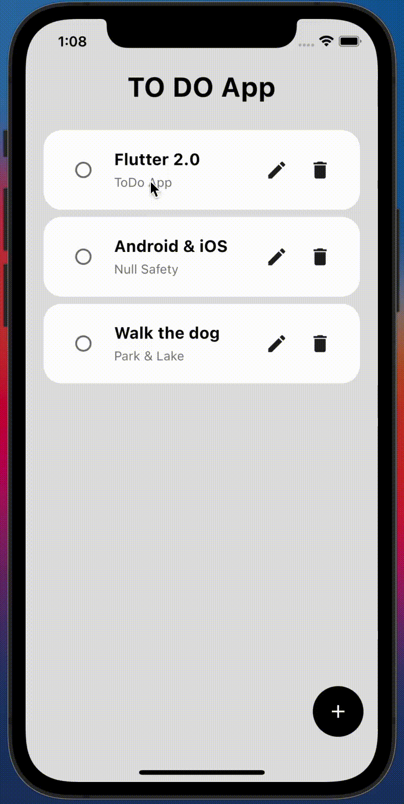
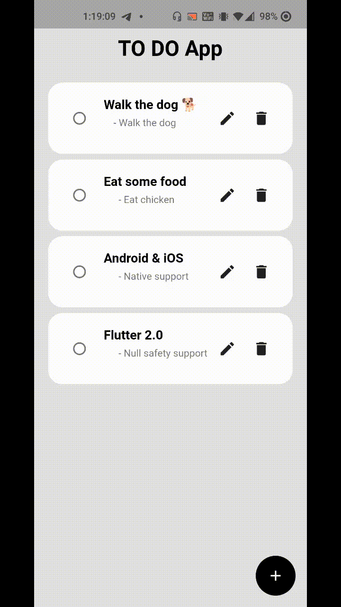

# ToDo App using Flutter 2.0

Developement Stack 

## Getting Started

This project is a starting point for a Flutter application.

A few resources to get you started if this is your first Flutter project:

- [Lab: Write your first Flutter app](https://flutter.dev/docs/get-started/codelab)
- [Cookbook: Useful Flutter samples](https://flutter.dev/docs/cookbook)

For help getting started with Flutter, view our
[online documentation](https://flutter.dev/docs), which offers tutorials,
samples, guidance on mobile development, and a full API reference.

1. Clone the repository `https://github.com/nakshatrasinghh/ToDo-App.git`
2. Run `flutter pub get` in terminal
3. Run `main.dart` and feel the power ⚡️

# Demo

I tried to add firebase to this project using `firebase_core` and `cloud_firestore` to store these tasks in a cloud db (firebase datastore) but null safety was giving me too many errors, will try again sometime soon. For now this is it. Make sure to star the repo. If you have any questions/suggestions, feel free to shoot me a dm. 
